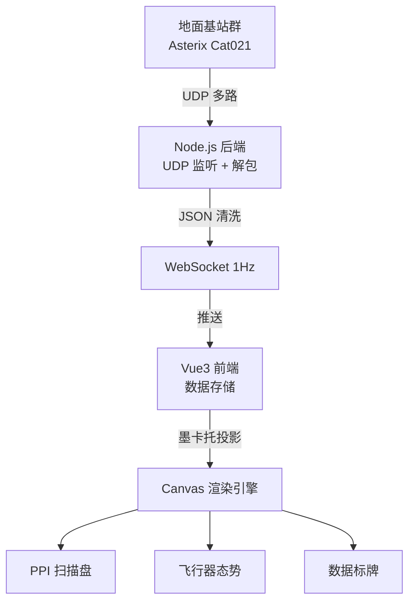
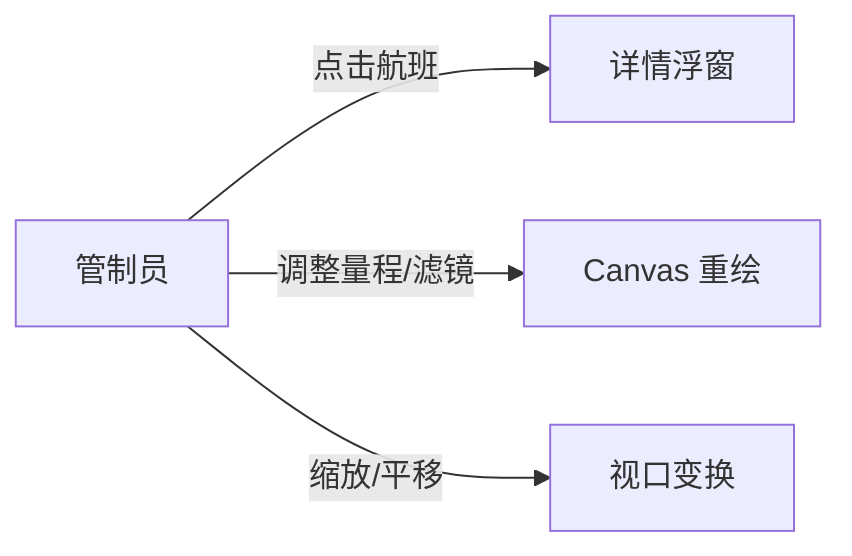

## 1. 产品概述
民航 ATC 雷达监控屏——一套高保真度的空中交通管制雷达态势显示系统，实时接收并解析 Asterix Cat021 格式 ADS-B 报文，在 Canvas 雷达盘面上绘制带有余辉拖影的扫描线、飞行器图标、速度矢量线及数据标牌。
- 目标用户：空管人员、航空数据分析师、ATC 培训学员
- 核心价值：以军用级雷达 PPI 显示器美学还原真实 ATC 工作站体验，同时提供数据可读性

## 2. 核心功能

### 2.1 用户角色
| 角色 | 权限 |
|------|------|
| 管制员 | 实时监视所有航班态势，调整雷达范围与显示参数 |
| 观察员 | 只读查看雷达画面与航班数据 |

### 2.2 功能模块
1. **雷达主屏页面**：PPI 雷达扫描盘、飞行器态势叠加层、侧边控制面板
2. **航班详情浮窗**：选中航班的完整飞行参数卡片

### 2.3 页面详情
| 页面名称 | 模块名称 | 功能描述 |
|----------|----------|----------|
| 雷达主屏 | PPI 扫描盘 | Canvas 绘制圆形雷达盘面，包含同心距标环、方位刻度、旋转扫描线及余辉拖影衰减特效 |
| 雷达主屏 | 飞行器态势层 | 根据实时数据绘制飞机图标、速度矢量线（基于航向与地速）、含航班号/高度/地速的数据标牌 |
| 雷达主屏 | 侧边控制面板 | 雷达量程切换（10/20/40/80 NM）、显示滤镜开关（标牌/矢量线/航迹）、UDP 连接状态指示灯 |
| 航班详情浮窗 | 参数卡片 | 点击航班图标弹出，展示航班号、呼号、经纬度、高度（FL）、地速、航向、爬升率等完整参数 |

## 3. 核心流程

主数据流：地面基站群 → UDP → Node.js 后端（Asterix Cat021 解包）→ JSON 清洗 → WebSocket 1Hz 推送 → 前端 Canvas 重绘

用户交互流：用户点击航班 → 弹出详情浮窗 → 调整雷达量程/滤镜 → Canvas 即时重绘

## 4. 用户界面设计

### 4.1 设计风格
- **主色调**：磷光绿 (#00FF41) 经典雷达荧光色，搭配深黑 (#0A0E14) 背景
- **辅助色**：琥珀橙 (#FF6B35) 用于告警，冰蓝 (#00D4FF) 用于选中态
- **字体**：JetBrains Mono（等宽数据字体）+ Orbitron（HUD 标题字体）
- **布局**：沉浸式全屏雷达盘 + 右侧窄控制栏，顶部状态条
- **风格**：军用级 CRT 雷达美学——扫描线余辉、磷光闪烁、暗角晕影，兼具赛博朋克与航空工业感

### 4.2 页面设计概述
| 页面名称 | 模块名称 | UI 元素 |
|----------|----------|---------|
| 雷达主屏 | PPI 扫描盘 | 圆形雷达盘占满主视口，同心距标环（虚线），方位刻度（0°-360°），旋转扫描线带余辉衰减（磷光绿渐隐），CRT 暗角晕影叠加 |
| 雷达主屏 | 飞行器态势 | 飞机三角图标（磷光绿），速度矢量线（2min 预测线，渐变透明），标牌（航班号+高度+地速，白色小字带半透明黑底） |
| 雷达主屏 | 侧边控制面板 | 窄栏（60px），暗色背景，量程按钮组（10/20/40/80），滤镜开关（图标式），UDP 状态灯（绿/红闪烁），时钟（UTC） |
| 雷达主屏 | 顶部状态条 | 深色条带，显示：当前量程、在线航班数、UTC 时间、UDP 包率 |
| 航班详情浮窗 | 参数卡片 | 半透明深色卡片，毛玻璃效果，航班号大字标题，参数键值对网格排列，关闭按钮 |

### 4.3 响应式
- 桌面优先设计，雷达盘面按视口最大尺寸自适应
- 最小支持 1280×720 分辨率
- 控制面板在窄屏下可折叠

### 4.4 3D 场景指导
- 不适用（纯 2D Canvas 项目）
