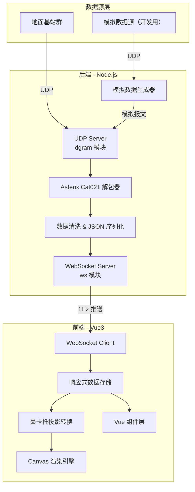
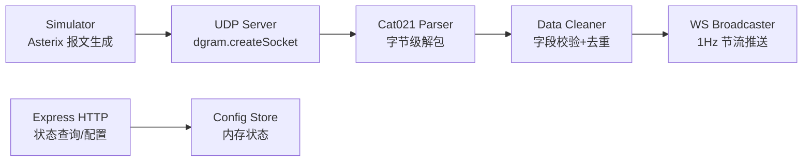
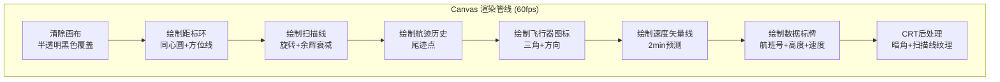

## 1. 架构设计



## 2. 技术说明
- **前端**：Vue3 + TypeScript + HTML5 Canvas API + Tailwind CSS
- **初始化工具**：vite-init (vue-express-ts 模板)
- **后端**：Express + TypeScript (ESM) + dgram (UDP) + ws (WebSocket)
- **数据库**：无（纯实时流，不持久化）
- **模拟数据**：内置 Asterix Cat021 模拟器，可在无真实基站时提供演示数据

## 3. 路由定义
| 路由 | 用途 |
|------|------|
| / | 雷达主屏页面（全屏 Canvas + 控制面板） |

## 4. API 定义

### 4.1 WebSocket 消息格式

**后端 → 前端（航班态势推送）**
```typescript
interface RadarTrack {
  icao24: string
  callsign: string
  lat: number
  lon: number
  altitude: number
  groundSpeed: number
  track: number
  verticalRate: number
  timestamp: number
}

interface RadarUpdate {
  type: 'track_update'
  tracks: RadarTrack[]
  timestamp: number
}
```

**前端 → 后端（控制命令）**
```typescript
interface RadarCommand {
  type: 'set_range' | 'toggle_filter' | 'select_track'
  payload: number | string | object
}
```

### 4.2 REST API（Express）
| 端点 | 方法 | 用途 |
|------|------|------|
| /api/status | GET | 获取 UDP 连接状态、包率、在线航班数 |
| /api/config | GET | 获取当前雷达配置（量程、滤镜状态） |
| /api/config | POST | 更新雷达配置 |
| /api/simulator/toggle | POST | 启停模拟数据源 |

## 5. 服务端架构图



## 6. 数据模型

### 6.1 Asterix Cat021 UAP 数据项映射

| FSPEC 位 | 数据项 | ICAO 标号 | 类型 | 长度(bytes) | 说明 |
|-----------|--------|-----------|------|-------------|------|
| bit1 | DataSourceIdentifier | I021/010 | Compound | 2 | SAC+SIC |
| bit2 | TargetReportDescriptor | I021/040 | Compound | 1+ | 报告类型标识 |
| bit3 | TrackNumber | I021/161 | Unsigned | 2 | 航迹号 |
| bit4 | ServiceIdentification | I021/015 | Unsigned | 1 | 服务标识 |
| bit5 | TimeOfDay | I021/030 | Unsigned | 3 | UTC时间(1/128s) |
| bit6 | PositionWGS84 | I021/130 | Compound | 6/8 | 经纬度(精度0.0001°) |
| bit7 | PositionWGS84HighRes | I021/131 | Compound | 8 | 高精度经纬度 |
| bit8 | FlightLevel | I021/140 | Unsigned | 2 | 飞行高度层(FL/4) |
| bit9 | MOPSVersion | I021/020 | Compound | 1+ | MOPS版本 |
| bit10 | Mode3ACode | I021/070 | Compound | 2 | 应答机编码 |
| bit11 | TargetAddress | I021/110 | Unsigned | 3 | ICAO 24bit地址 |
| bit12 | TargetIdentification | I021/170 | Char | 6 | 航班号(6字符) |
| bit13 | VelocityOverGround | I021/200 | Compound | 4 | 地速+航向 |
| bit14 | TrueAirSpeed | I021/210 | Compound | 2 | 真空速 |
| bit15 | VerticalRate | I021/105 | Compound | 2 | 垂直速率(6.25ft/m) |
| bit16 | EmitterCategory | I021/020 | Compound | 1+ | 飞机类别 |

### 6.2 坐标转换：WGS84 → 墨卡托屏幕坐标

```typescript
interface ProjectionConfig {
  centerLat: number
  centerLon: number
  rangeNm: number
  canvasSize: number
}

function wgs84ToScreen(lat: number, lon: number, config: ProjectionConfig): { x: number; y: number } {
  const nmPerDegLat = 60
  const nmPerDegLon = 60 * Math.cos(config.centerLat * Math.PI / 180)
  const pixelsPerNm = config.canvasSize / (2 * config.rangeNm)
  const x = (lon - config.centerLon) * nmPerDegLon * pixelsPerNm + config.canvasSize / 2
  const y = -(lat - config.centerLat) * nmPerDegLat * pixelsPerNm + config.canvasSize / 2
  return { x, y }
}
```

## 7. Canvas 渲染架构


